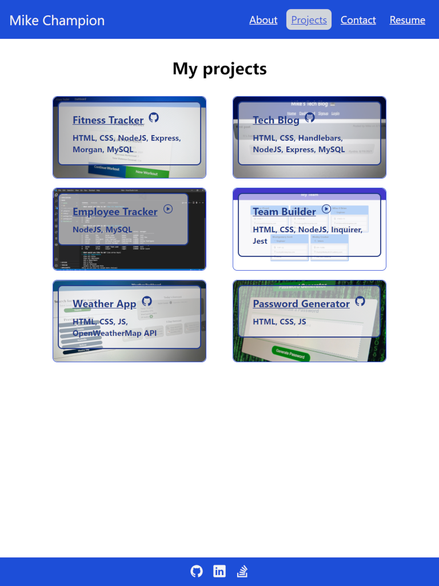

# React Portfolio

## Table of Contents

I. [Description](#description)  
II. [Packages](#packages)  
III. [Project screenshot](#screenshot)  
IV. [Link to deployed page](#live-page)  
V. [Contact information](#contact)

## <a id="description">I. Description</a>

Updating my previously created portfolio to use React
Updating pinned repositories and deployed page on Github.

This was a great project, I've been looking forward to learning React for a while and definitely learned a lot doing this.

## <a id="credits">II. Credits</a>

This <a href="https://www.npmjs.com/package/react" target="_blank">react</a> project began with <a href="https://www.npmjs.com/package/create-react-app" target="_blank">create-react-app</a>, uses <a href="https://www.npmjs.com/package/react-router-dom" target="_blank">react-router-dom</a> for routing, CSS was all done using <a href="https://www.npmjs.com/package/tailwindcss" target="_blank">tailwindcss</a>, <a href="https://www.npmjs.com/package/ionicons" target="_blank">ionicons</a> for the footer icons and the 'github' and 'play' icons on the project page, and <a href="https://www.npmjs.com/package/gh-pages" target="_blank">gh-pages</a> to deploy live on github pages.

## <a id="screenshot">II. Screenshot</a>

## <a id="live-page">III. Link to deployed page</a>

Portfolio
https://mikechampion.github.io/react-portfolio/

## <a id="contact">IV. Contact</a>

Linkedin profile
https://www.linkedin.com/in/MikeChampion42

Github profile
https://github.com/MikeChampion

PDF resume
https://mikechampion.github.io/portfolio/assets/pdf/Michael_Champion_Resume_0621.pdf
